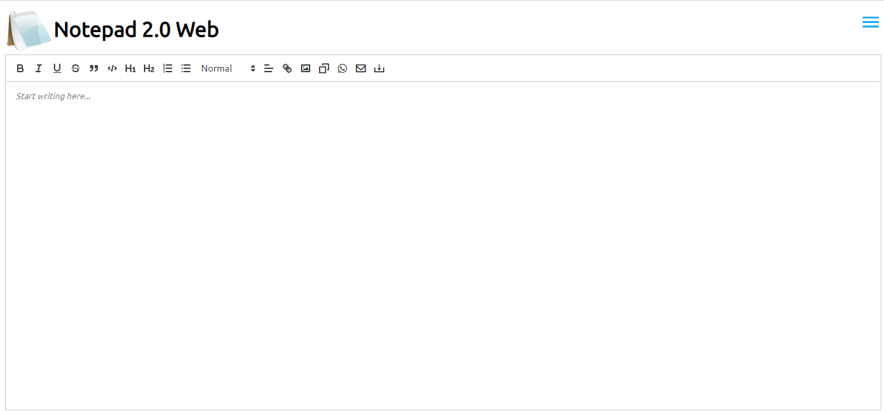

# Notepad-web-version
This is a web version of Notepad created using HTML, CSS, Javascript and jQuery. This will be added as a dual platform feature in Notepad 2.0.

 

## Features
<li>Styling – The user can make the text Bold, Itallic or Underlined.
<li>Headings – The user can define headings in his files
<li>Lists – The user can define ordered or unordered lists.
<li>Alignment – The user can change the alignment of the text in the textarea.
<li>Copy to Clipboard – The user can copy the text of textarea in the clipboard.
<li>Download file – The user can download the files in his system with the defined content.
<li>Share to Whatsapp – The user can share the files on whatsapp through this application.
<li>Quote format – The user can use the quote format for the text in the textarea.

